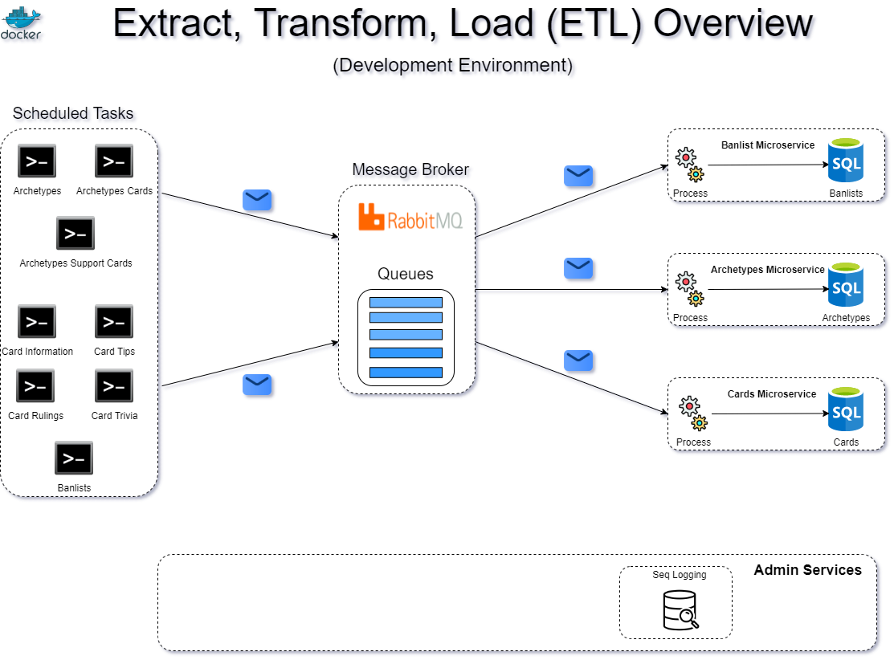

|**Applications**|**Description**
|:-----:|:-----:|
[Article](https://github.com/fablecode/yugioh-insight/tree/master/src/wikia/article)| Articles to process
[Data](https://github.com/fablecode/yugioh-insight/tree/master/src/wikia/data)| Amalgamate article data
[Processor](https://github.com/fablecode/yugioh-insight/tree/master/src/wikia/processor)| Persist article

# Yugioh-Insight
Yugioh Insight is a collection of solutions for gathering [Yu-Gi-Oh](http://www.yugioh-card.com/uk/) data from various sources.

## Architecture Overview
This application is cross-platform at the server and client side, thanks to .NET 5 services capable of running on Linux or Windows containers depending on your Docker host. 
The architecture proposes a microservice oriented architecture implementation with multiple autonomous microservices (each one owning its own data/db) and implementing different approaches within each microservice (simple CRUD vs. DDD/CQRS patterns) using Http as the communication protocol between the client apps and the microservices and supports asynchronous communication for data updates propagation across multiple services based on an Event Bus ([RabbitMQ](https://www.rabbitmq.com/)). 

## 

## Built With
* [Visual Studio 2019](https://www.visualstudio.com/downloads/)
* [.NET Core 2.2](https://www.microsoft.com/net/download/core)
* [Onion Architecture](http://jeffreypalermo.com/blog/the-onion-architecture-part-1/) and [CQRS](https://martinfowler.com/bliki/CQRS.html).
* [RabbitMq](https://www.rabbitmq.com/)
* [Visual Studio Team Services](https://www.visualstudio.com/team-services/release-management/) for CI and deployment.
* [Dataflow Blocks (Task Parallel Library)](https://docs.microsoft.com/en-us/dotnet/standard/parallel-programming/dataflow-task-parallel-library)
* [Mediatr](https://www.nuget.org/packages/MediatR/) for CQRS and the Mediator Design Pattern. Mediator design pattern defines how a set of objects interact with each other. You can think of a Mediator object as a kind of traffic-coordinator, it directs traffic to appropriate parties.
* [Fluent Validations](https://www.nuget.org/packages/FluentValidation)
* [Fluent Assertions](https://www.nuget.org/packages/FluentAssertions)
* [NUnit](https://github.com/nunit/nunit)
* [Scrutor](https://github.com/khellang/Scrutor) for decorator pattern implementation
* [Dataflow Blocks (Task Parallel Library)](https://docs.microsoft.com/en-us/dotnet/standard/parallel-programming/dataflow-task-parallel-library)